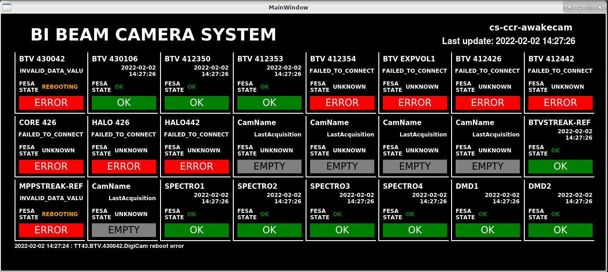

# AWAKE Camera Monitoring

A vistars-style panel to monitor the digital cameras status of BI digital camera systems. 

## Description

The panel shows the status of the 24 cameras of one 24-port PoE switch. 

The status: 
- **OK**
- **FROZEN**: the acquisition does not return error, but the last timestamp is old
- **ERROR**: an error is returned when trying to acquire the last image

for ERROR and FROZEN, clicking on the label will trigger the camera reboot with a downtime of 5 seconds. 

## Installation

This has not been packaged yet, so just clone the repository and execute `./launch_camera_monitor.sh`. This will activate the acc-py distribution and launch the panel. 

One must specify the system to monitor, using the option `--laser` or `--beamline`. A version for the control room with larger fonts and panel is available by adding the argument `--large`. 

## Setup

Edit the file ./config/cameras_setup.xml. Each camera entry needs to have a name, the fesa device name and the port at wich is connected. Some basic checks are performed on the numbers entered.

To run the application, you need to create a python virtual environment. You need to install in it `pyjapc` and `xmltodict`. Instructions on creating the venv on https://abpcomputing.web.cern.ch/guides/accpy/ 
